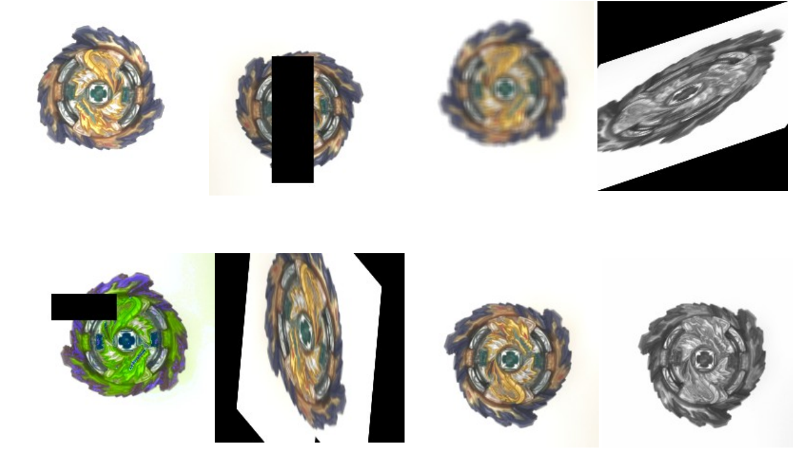

# Image Augmentation Example

This example demonstrates how to use image augmentation functions. It is implemented as similar as possible to [original Pytorch vision/transform](https://pytorch.org/vision/stable/transforms.html#).

There are 2 APIs (`aug.Compose` and `aug.OneOf`) to compose augmentation methods as shown in the example: 

```go
		t, err := aug.Compose(
			aug.WithRandomVFlip(0.5),
			aug.WithRandomHFlip(0.5),
			aug.WithRandomCutout(),
			aug.OneOf(
				0.3,
				aug.WithColorJitter(0.3, 0.3, 0.3, 0.4),
				aug.WithRandomGrayscale(1.0),
			),
			aug.OneOf(
				0.3,
				aug.WithGaussianBlur([]int64{5, 5}, []float64{1.0, 2.0}),
				aug.WithRandomAffine(),
			),
		)
		if err != nil {
			panic(err)
		}

		out := t.Transform(imgTs)
```





